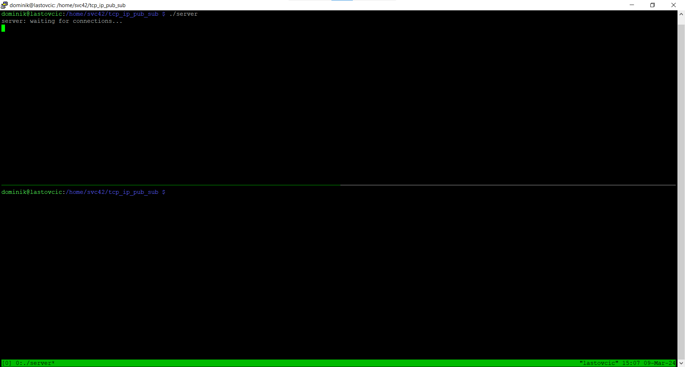
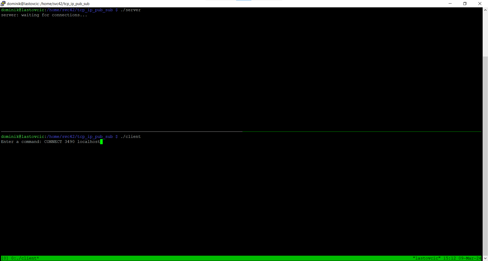
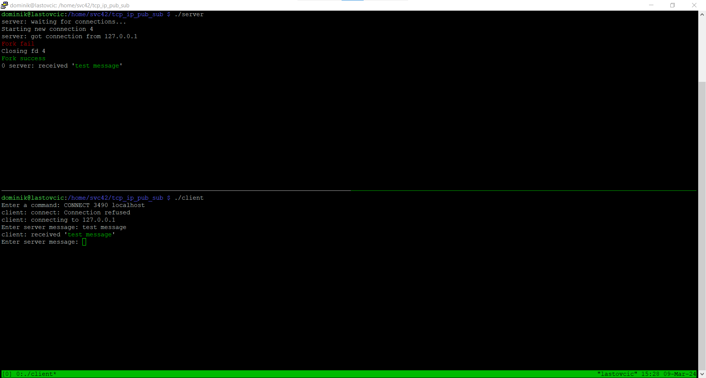
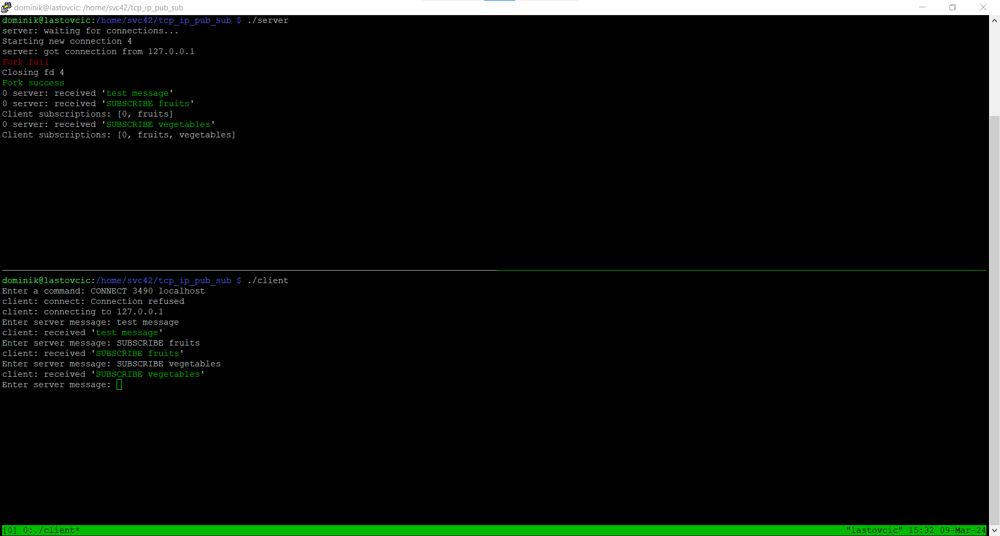
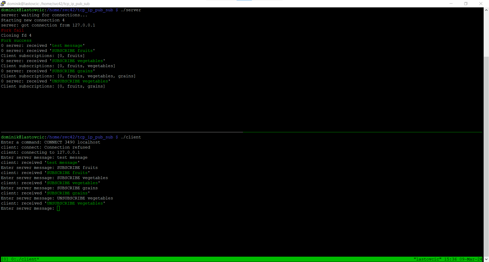
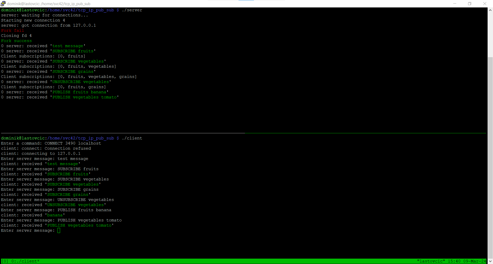

# TCP/IP Publish Subscribe

This project will demonstrate the basic example for the publish-subscribe communication protocol on the TCP/IP layer.

We will use `server.cpp` nad `client.cpp` for this purpose. `client_testing.cpp` was used only to speed up testing and it can be ignored.

Contents
========

* [Compilation](#Compilation)
* [Installation](#installation)
  * [Method 1: <a href="https://en.wikipedia.org/wiki/APT_(software)" rel="nofollow">apt install</a>](#method-1-apt-install)


### Installation
---

We will be using the GNU c++ compiler - [`g++`](https://www.geeksforgeeks.org/compiling-with-g-plus-plus/)

> If by any chance g++ is not preinstalled on your system, here is a way to install it:
#### Method 1: apt install


```bash
$ sudo apt update
$ sudo apt upgrade
$ sudo apt install g++
```


### Compilation

Now when we have the compiler installed in our system, we can compile the source files. First the server application:

```bash
$ g++ server.cpp -o server
```

And then the client application:
```bash
$ g++ client.cpp -o client
```

### Description

#### Server

The server application accepts client connections on the selected port and prints diagnostic messages (connecting/disconnecting
the client (CONNECT/DISCONNECT), receiving and sending messages (PUBLISH/SUBSCRIBE).
Server applications make sure that PUBLISH messages on a certain topic are forwarded only to clients who are subscribed to that
topic (SUBSCRIBE). For this reason, the server application must keep records of which clients are subscribed to which topic in
order to correctly redirect messages. The server application execution port is passed as the first argument when starting the
application. After starting, the server application immediately opens a TCP server and accepts connections from new clients.

#### Client

The client application connects to the server application and serves to send and receive messages from specific topics.
```shell
Usage: CLIENT COMMANDS:

* CONNECT <port> <client name> - Starts a connection to an arbitrary server application
* DISCONNECT – Disconnecting from the currently connected server application
* PUBLISH <topic name> <data> - Sends an arbitrary (ASCII) message to a specific topic 
* SUBSCRIBE <topic name> - The client subscribes to a specific topic
* UNSUBSCRIBE <topic name> - The client disconnects from the specific topic
```

If at any time the client receives a message from a subscribed topic, it immediately prints it to the console in the following
form "[Message] Topic: <topic name> Data: <data>". For writing purposes, the following things can be assumed:
• The name of the topic is in ASCII format and never contains a space
• Data to be sent and received are always in ASCII format
• Delimitation of messages on the TCP/IP layer can be performed with a predefined character

### Usage
---

1. Run the server app `$ ./server`




2. Run the client app `$ ./client`
3. Type `CONNECT 3490 localhost` to the client console 



application

4. If the connection was successful, we can now send messages to the server and receive them back


5. Now we can subscribe to different topics



6. And also unsubscribe


7. Since the PUBLISH feature is not yet fully implemented, the server will only send back the data portion of the PUBLISH message to indicate that it recognizes subscribed topics.
